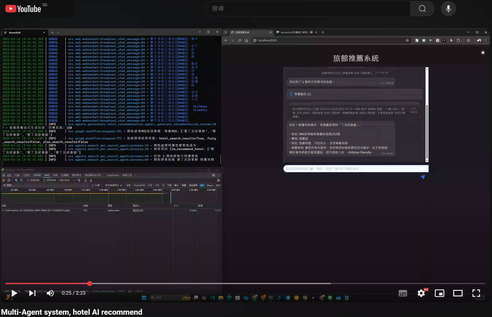

# 旅館推薦 Multi-Agent Chatbot 系統

基於LangGraph的旅館推薦多Agent系統，為用戶提供旅遊住宿與周邊探索的整合解決方案。

[](https://youtu.be/HhIShq96qHA)


## 系統架構

本系統採用LangGraph框架實現多Agent協作，主要包含以下組件：

1. **解析類Agent群組**：由多個專門的解析Agent組成，包括：

   - 日期解析
   - 預算解析
   - 地理位置解析
   - 住客資訊解析
   - 旅館類型解析
   - 關鍵字解析
   - 特殊需求解析
   - 餐食需求解析
   - 供應商資訊解析
2. **搜索類Agent群組**：

   - 旅館搜索Agent
   - 旅館模糊搜索Agent
   - 旅館方案搜索Agent
   - 周邊景點搜索Agent
3. **回應生成Agent**：負責整合所有信息，生成最終的回應。
4. **地理資料快取**：存儲台灣縣市鄉鎮等地理資料，加速查詢解析過程。

系統工作流程如下：

```
用戶查詢 -> 查詢解析(多個專門解析Agent並行處理) -> 旅館搜索 -> 初步回應 -> 周邊地標搜索 -> 最終回應
```

## 特點

- **快速響應**：系統在5秒內提供初步回應，30秒內提供完整建議。
- **並行處理**：多個Agent並行工作，提高效率。
- **漸進式回應**：先提供初步結果，再補充詳細信息。
- **容錯機制**：處理各種異常情況，確保系統穩定性。
- **用戶友好**：提供直觀的Web界面，支持實時對話。
- **地理資料快取**：預加載台灣縣市鄉鎮資料，大幅提升查詢解析速度。

## 技術棧

- **Python 3.13**：基礎編程語言
- **LangGraph**：多Agent協作框架
- **FastAPI**：Web服務框架
- **WebSocket**：實時通信
- **Pydantic v2**：數據驗證
- **aiohttp**：異步HTTP客戶端
- **loguru**：日誌記錄
- **orjson**：高性能JSON處理
- **Redis/SQLite**：地理資料快取存儲

## 安裝與運行

### 環境要求

- Python 3.13+
- 可選：OpenAI API密鑰或本地Ollama服務

### 安裝步驟

1. 克隆倉庫：

```bash
git clone https://github.com/yourusername/hotel-recommendation-system.git
cd hotel-recommendation-system
```

2. 創建虛擬環境：

```bash
python -m venv .venv
source .venv/bin/activate  # Linux/Mac
# 或
.venv\Scripts\activate  # Windows
```

3. 安裝依賴：

```bash
pip install -r requirements.txt
```

4. 配置環境變量：

複製 `.env.example`為 `.env`，並填寫相關配置：

```bash
cp .env.example .env
# 編輯.env文件，填寫API密鑰等信息
```

### 運行系統

```bash
python main.py
```

訪問 http://localhost:8000 即可使用系統。

## API文檔

系統提供以下API：

- `GET /`：Web界面
- `POST /api/chat`：聊天API
- `WebSocket /ws/chat/{conversation_id}`：WebSocket聊天

## 系統架構解析

### 目錄結構

```
├── main.py                 # 主入口文件
├── requirements.txt        # 依賴列表
├── .env                    # 環境變量
├── src/                    # 源代碼
│   ├── api/                # API模塊
│   │   ├── client.py       # API客戶端
│   │   └── services.py     # API服務
│   ├── agents/             # Agent模塊
│   │   ├── base/           # 基礎Agent類
│   │   ├── parsers/        # 解析類Agent
│   │   │   ├── budget_parser_agent.py
│   │   │   ├── date_parser_agent.py 
│   │   │   ├── food_req_parser_agent.py
│   │   │   ├── geo_parser_agent.py
│   │   │   ├── guest_parser_agent.py
│   │   │   ├── hotel_type_parser_agent.py
│   │   │   ├── keyword_parser_agent.py
│   │   │   ├── special_req_parser_agent.py
│   │   │   └── supply_parser_agent.py
│   │   ├── search/         # 搜索類Agent
│   │   │   ├── hotel_search_agent.py
│   │   │   ├── hotel_search_fuzzy_agent.py
│   │   │   ├── hotel_search_plan_agent.py
│   │   │   └── poi_search_agent.py
│   │   └── generators/     # 生成類Agent
│   │       └── response_generator_agent.py
│   ├── cache/              # 快取模塊
│   │   └── geo_cache.py    # 地理資料快取
│   ├── controllers/        # 控制器模塊
│   ├── di/                 # 依賴注入模塊
│   ├── graph/              # LangGraph模塊
│   │   └── workflow.py     # 工作流定義
│   ├── models/             # 數據模型
│   │   └── schemas.py      # 數據結構定義
│   ├── protocols/          # 協議模塊
│   ├── services/           # 服務模塊
│   │   └── llm_service.py  # LLM服務
│   ├── utils/              # 工具模塊
│   ├── web/                # Web模塊
│   │   ├── app.py          # FastAPI應用
│   │   ├── websocket.py    # WebSocket處理
│   │   ├── websocket_handler.py # WebSocket處理程序
│   │   ├── static/         # 靜態文件
│   │   └── templates/      # HTML模板
│   └── config.py           # 配置模塊
└── tests/                  # 測試模塊
```

### 核心模塊說明

#### 1. 配置管理 (`src/config.py`)

包含系統所有配置項目，主要分為：

- API配置：API端點、密鑰等
- LLM配置：LLM提供商選擇
- Ollama配置：本地LLM模型設定
- 系統配置：超時、重試次數等
- FastAPI配置：主機、端口等

#### 2. Agent架構

系統採用多層次Agent架構，每個Agent專注於特定任務：

**解析類Agent**：分別負責解析不同類型的用戶需求：

- 日期解析：處理入住/退房日期
- 預算解析：處理價格預算範圍
- 地理位置解析：處理地點資訊
- 住客解析：處理旅客人數、組成等信息
- 旅館類型解析：處理旅館類型偏好
- 關鍵字解析：處理其他關鍵詞信息
- 特殊需求解析：處理特殊要求
- 餐食需求解析：處理餐食相關需求
- 供應商解析：處理特定供應商偏好

**搜索類Agent**：

- 旅館搜索：基本旅館搜索功能
- 旅館模糊搜索：處理不完整條件下的搜索
- 旅館方案搜索：搜索特定方案
- 景點搜索：搜索周邊景點

**生成類Agent**：

- 回應生成：綜合所有信息，生成流暢的回應

#### 3. 地理資料快取 (`src/cache/geo_cache.py`)

預加載並快取台灣的地理資料，減少運行時查詢負擔：

- 縣市資料
- 鄉鎮區資料
- 地理座標資料

#### 4. 工作流程定義 (`src/graph/workflow.py`)

使用LangGraph框架定義整個系統的工作流程：

- 定義節點之間的關係
- 處理並行任務
- 管理條件分支
- 錯誤處理與重試機制

#### 5. Web界面 (`src/web/`)

提供用戶界面和API端點：

- FastAPI應用服務
- WebSocket實時通信
- 靜態資源和模板

## 開發進度

### 已完成

- [X] 基礎框架設定與專案結構
- [X] 配置管理系統
- [X] LLM服務整合 (OpenAI & Ollama)
- [X] Agent定義與實現
  - [X] 解析類Agent群組
  - [X] 搜索類Agent群組
  - [X] 回應生成Agent
- [X] 地理資料快取系統
- [X] LangGraph工作流定義
- [X] FastAPI後端服務
- [X] WebSocket支援

### 進行中

- [ ] 測試與性能優化
- [ ] 各類解析調優
- [ ] 更多API整合

## 許可證

MIT
